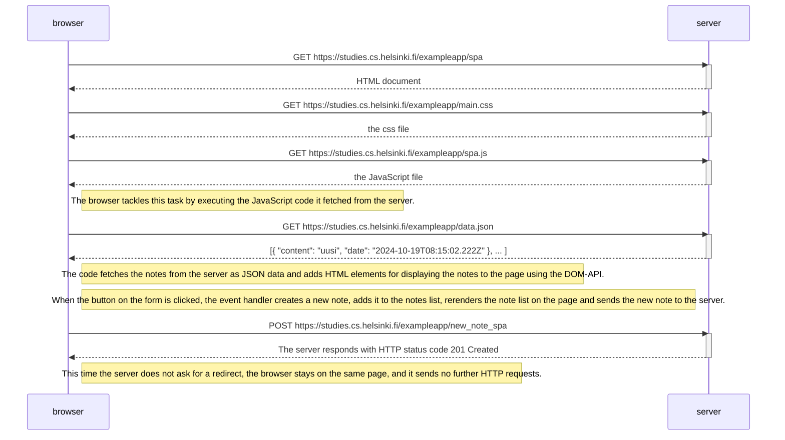

```mermaid
sequenceDiagram
participant browser
participant server

    browser->>server: GET https://studies.cs.helsinki.fi/exampleapp/spa
    activate server
    server-->>browser: HTML document
    deactivate server

    browser->>server: GET https://studies.cs.helsinki.fi/exampleapp/main.css
    activate server
    server-->>browser: the css file
    deactivate server

    browser->>server: GET https://studies.cs.helsinki.fi/exampleapp/spa.js
    activate server
    server-->>browser: the JavaScript file
    deactivate server

    Note right of browser: The browser tackles this task by executing the JavaScript code it fetched from the server.

    browser->>server: GET https://studies.cs.helsinki.fi/exampleapp/data.json
    activate server
    server-->>browser: [{ "content": "uusi", "date": "2024-10-19T08:15:02.222Z" }, ... ]
    deactivate server

    Note right of browser: The code fetches the notes from the server as JSON data and adds HTML elements for displaying the notes to the page using the DOM-API.

    Note right of browser: When the button on the form is clicked, the event handler creates a new note, adds it to the notes list, rerenders the note list on the page and sends the new note to the server.

    browser->>server: POST https://studies.cs.helsinki.fi/exampleapp/new_note_spa
    activate server
    server-->>browser: The server responds with HTTP status code 201 Created
    deactivate server

    Note right of browser: This time the server does not ask for a redirect, the browser stays on the same page, and it sends no further HTTP requests.
```
